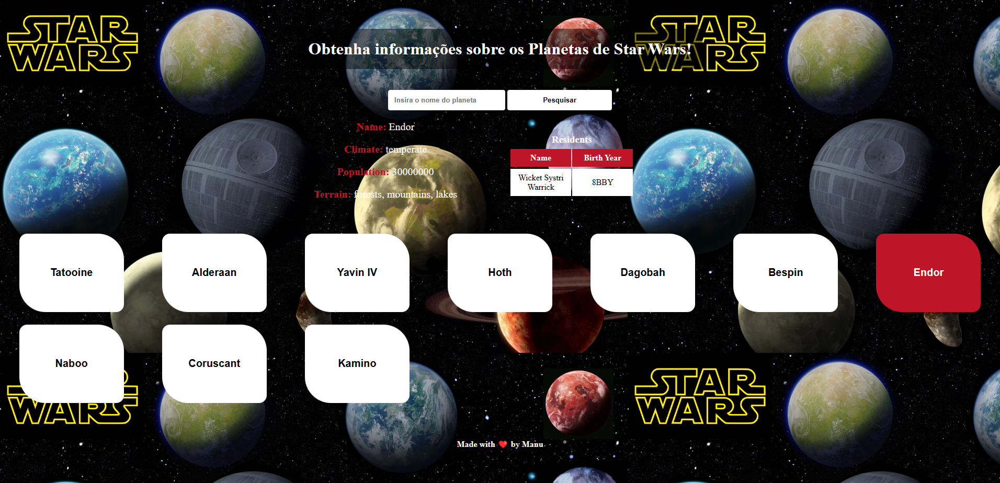
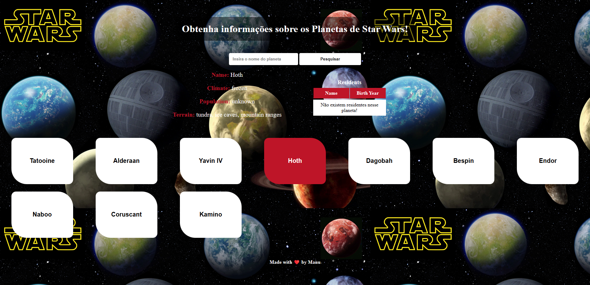
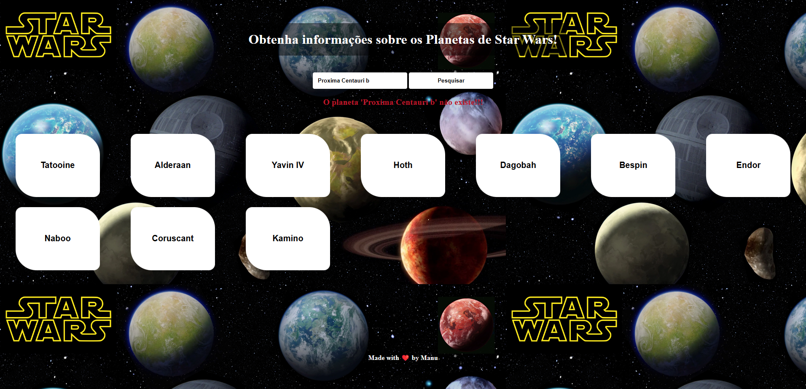

# Censo Galático - Star Wars (Desafio Treina Dev)
> ⭐⚔️ Obtenha informações sobre os Planetas de Star Wars!

### 🤖 Imagem do Projeto


[Clique aqui para acessar a documentação da API - SWAPI The Star Wars API](https://swapi.dev/documentation)

O projeto precisa ter:

- [x] Listagem de planetas da API (console)
- [x] Botões com o nome dos planetas listados
- [x] Obtenção das informações do planeta ao clicar no botão
- [x] Obtenção das informações do planeta dado um input de texto
- [x] Tarefa Bônus - Exiba os residentes de um planeta em uma tabela

### 🌌 Preview Link
[Clique aqui para acessar o projeto](https://emmanuellaalbuquerque.github.io/CensoGalaticoStarWars/)

### 🌍 Quando o planeta não tem residentes!


### 🌍 Quando o planeta pesquisado não existe!


```ruby
while alive
  eat()
  sleep()
  code()
  repeat()
end
```

<p style="text-align:center;">Made with ❤️ by Manu!</p>
